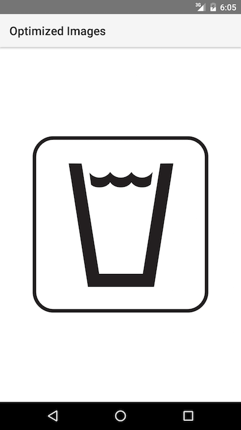
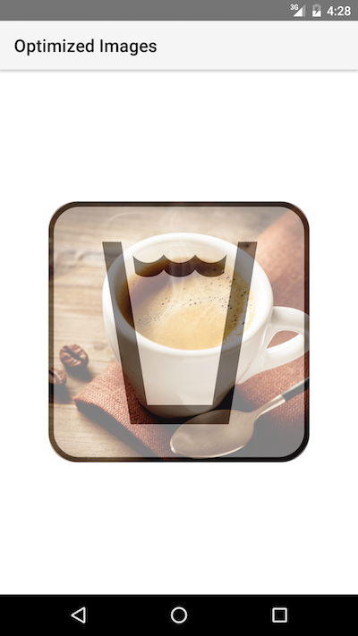
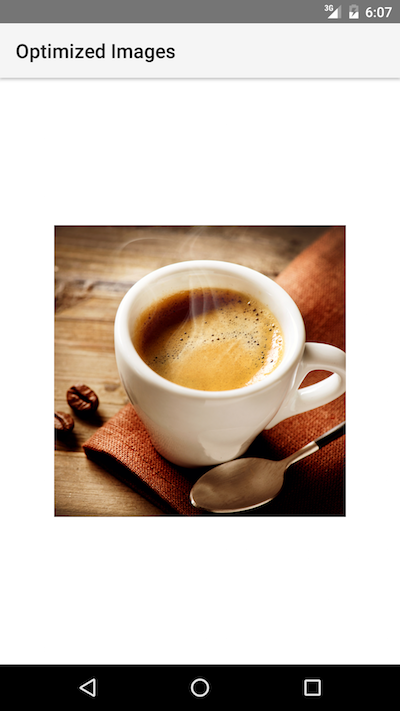

# Welcome to `nativescript-fresco`

> A NativeScript Plugin for Android apps.

[](https://www.npmjs.com/package/nativescript-fresco)
[](https://www.npmjs.com/package/nativescript-fresco)
[](https://david-dm.org/NativeScript/nativescript-fresco)
[](https://david-dm.org/NativeScript/nativescript-fresco?type=peer)

## What is `nativescript-fresco`?
`nativescript-fresco` is a NativeScript plugin that exposes the Fresco library used for efficiently displaying images on Android. More information about what Fresco is and how it works is available on its official website [here](https://code.facebook.com/posts/366199913563917/introducing-fresco-a-new-image-library-for-android/).

The `nativescript-fresco` plugin enables NativeScript developers to use the `FrescoDrawee` class which is extends the traditional Android ImageView component and adds the smart Fresco image management algorithms. The plugin exposes the drawee as a NativeScript view so you basically put it in the XML definition of your page and provide the URI to the image you would like to use.

## How to use `nativescript-fresco`?

### In vanila NativeScript
#### From npm
1. Go to the root folder of your {N} application where you would like to install the plugin and type `tns plugin add nativescript-fresco`.
4. Initialize `nativescript-fresco` in the `launch` event of your {N} application by using the following code:

#### From local repo?
1. Clone the repository and go to the root directory on your computer.
2. Use `tsc` to transpile the `.ts` sources: `tsc -p`.
3. Go to the root folder of your {N} application where you would like to install the plugin and type `tns plugin add <path-to-fresco-repo-dir>`.
4. Initialize `nativescript-fresco` in the `launch` event of your {N} application by using the following code:

JavaScript:

```javascript
var application = require("application");
var fresco = require("nativescript-fresco");

if (application.android) {
    application.on("launch", function () {
        fresco.initialize();
    });
}
```

TypeScript:

```typescript
import application = require("application");
import fresco = require("nativescript-fresco");

if (application.android) {
    application.on("launch", () => {
        fresco.initialize();
    });
}
```

Use `fresco` in the XML definition of the page as follows:

```xml
<Page
    xmlns="http://www.nativescript.org/tns.xsd" 
    xmlns:nativescript-fresco="nativescript-fresco">
    <nativescript-fresco:FrescoDrawee width="250" height="250"
                                      imageUri="<uri-to-a-photo-from-the-web-or-a-local-resource>"/>
</Page>
```

### In NativeScript + Angular 2

1. Import the `TNSFrescoModule` from `nativescript-fresco/angular` and add it to the `imports` of your initial `@NgModule`, like shown [here](https://github.com/NativeScript/nativescript-fresco/blob/master/demo/app/app.module.ts).
2. As described above make sure to initialize the `nativescript-fresco` plugin in the `launch` event of your {N} application.

## Examples
You can refer the [demo](https://github.com/NativeScript/nativescript-fresco/tree/master/demo) folder of the repo for runnable {N} project that demonstrates the nativescript-fresco plugin with all of its features in action.

## Features

As documented by the Fresco library setting the **height and width** are **mandatory**, more details on this topic could be found [here](http://frescolib.org/docs/using-drawees-xml.html#height-and-width-mandatory). So the first this you should do when declaring the FrescoDrawee is set its *width* and *height* attributes or set only one of them and set the FrescoDrawee's **aspectRatio**. The width and height of the FrescoDrawee in your {N} application supports percentages which makes it possible to declare for example *width="50%"* and *aspectRatio="1.33"* achieving exactly 50% width with dynamically calculated height based on the aspect ration of the loaded image from the *imageUri*.

### Basic attributes

- **imageUri** 

String value used for the image URI. You can use this property to set the image to be loaded from remote location (http, https), from the resources and local files of your {N} application.

```xml
<nativescript-fresco:FrescoDrawee imageUri="https://docs.nativescript.org/angular/img/cli-getting-started/angular/chapter0/NativeScript_logo.png"/>
```

- **placeholderImageUri** 

String value used for the placeholder image URI. You can use this property to set a placeholder image loaded from the local and resources files of your {N} application.

**Note: Currently there are limitations on how many different Images can be set to as 'placeholderImage' before OutOfMemoryError is thrown. For best results its recommended to use a single image for all ```placeholderImageUri``` of your FrescoDrawee instances.*

```xml
<nativescript-fresco:FrescoDrawee placeholderImageUri="~/placeholder.jpg"/>
```

- **failureImageUri** 

String value used for the failure image URI. You can use this property to set a failure image loaded from the local and resources files of your {N} application that will be shown if the loading of the imageUri is not successful.

```xml
<nativescript-fresco:FrescoDrawee failureImageUri="~/failure.jpg"/>
```


### Advanced *optional* attributes

There are a couple of *optional* attributes that could be set on the FrescoDrawee instance to achieve advanced behaviors:

- **backgroundUri** 

String value used for the background image URI. Using this property has similar effect as the placeholderImageUri but the image is stretched to the size of the FrescoDrawee.

**Note: Currently there are limitations on how many different Images can be set to as 'background' before OutOfMemoryError is thrown. For best results its recommended to use a single image for all ```backgroundUri``` of your FrescoDrawee instances.*

```xml
<nativescript-fresco:FrescoDrawee backgroundUri="~/image.jpg"/>
```

- **actualImageScaleType** 

String value used by FrescoDrawee image scale type. This property can be set to:

'*center*' - Performs no scaling.

'*centerCrop*' - Scales the child so that both dimensions will be greater than or equal to the corresponding dimension of the parent.

'*centerInside*' - Scales the child so that it fits entirely inside the parent.

'*fitCenter*' - Scales the child so that it fits entirely inside the parent.

'*fitStart*' - Scales the child so that it fits entirely inside the parent.

'*fitEnd*' - Scales the child so that it fits entirely inside the parent.

'*fitXY*' - Scales width and height independently, so that the child matches the parent exactly.

'*focusCrop*' - Scales the child so that both dimensions will be greater than or equal to the corresponding dimension of the parent.

```xml
<nativescript-fresco:FrescoDrawee actualImageScaleType="centerInside"/>
```

- **fadeDuration** 

Number value used for the fade-in duration. This value is in milliseconds.

```xml
<nativescript-fresco:FrescoDrawee fadeDuration="3000"/>
```

- **aspectRatio** 

Number value used as the aspect ratio of the image. This property is useful when you are working with different aspect ratio images and want to have a fixed Width or Height. The ratio of an image is calculated by dividing its width by its height. 

*Note: In some layout scenarios it is necessary to set the ```verticalAlignment``` of the FrescoDrawee to 'top' or 'bottom' in order to "anchor" the drawee and achieve dynamic sizing.*

```xml
<nativescript-fresco:FrescoDrawee aspectRatio="1.33" verticalAlignment="top"/>
```

- **progressiveRenderingEnabled**

Boolean value used for enabling or disabling the streaming of progressive JPEG images. This property is set to 'false' by default. Setting this property to 'true' while loading JPEG images not encoded in progressive format will lead to a standard loading of those images.

```xml
<nativescript-fresco:FrescoDrawee progressiveRenderingEnabled="true"/>
```

- **showProgressBar** 

Boolean value used for showing or hiding the progress bar.

```xml
<nativescript-fresco:FrescoDrawee showProgressBar="true"/>
```

- **progressBarColor** 

String value used for setting the color of the progress bar. You can set it to hex values ("*#FF0000*") and/or predefined colors ("*green*").

```xml
<nativescript-fresco:FrescoDrawee progressBarColor="blue"/>
```

- **roundAsCircle** 

Boolean value used for determining if the image will be rounded as a circle. Its default value is false. If set to true the image will be rounder to a circle.

```xml
<nativescript-fresco:FrescoDrawee roundAsCircle="true"/>
```

- **roundedCornerRadius** 

Number value used as radius for rounding the image's corners.

```xml
<nativescript-fresco:FrescoDrawee roundedCornerRadius="50"/>
```

- **roundBottomRight** 

Boolean value used for determining if the image's bottom right corner will be rounded. The *roundedCornerRadius* is used as the rounding radius.

```xml
<nativescript-fresco:FrescoDrawee roundBottomRight="true"/>
```

- **roundBottomLeft** 

Boolean value used for determining if the image's bottom left corner will be rounded. The *roundedCornerRadius* is used as the rounding radius.

```xml
<nativescript-fresco:FrescoDrawee roundBottomLeft="true"/>
```

- **roundTopLeft** 

Boolean value used for determining if the image's top left corner will be rounded. The *roundedCornerRadius* is used as the rounding radius.

```xml
<nativescript-fresco:FrescoDrawee roundTopLeft="true"/>
```

- **roundTopRight** 

Boolean value used for determining if the image's top right corner should be rounded. The *roundedCornerRadius* is used as the rounding radius.

```xml
<nativescript-fresco:FrescoDrawee roundTopRight="true"/>
```

- **autoPlayAnimations** 

Boolean value used for enabling the automatic playing of animated images. Note that rounding of such images is not supported and will be ignored.

```xml
<nativescript-fresco:FrescoDrawee autoPlayAnimations="true"/>
```

- **tapToRetryEnabled** 

Boolean value used for enabling/disabling a tap to retry action for the download of the FrescoDrawee image.

```xml
<nativescript-fresco:FrescoDrawee tapToRetryEnabled="true"/>
```

### Events

- **finalImageSet** - arguments *FinalEventData*

This event is fired after the final image has been set. When working with animated images you could use this event to start the animation by calling the *FinalEventData.animatable.start()* function.

```xml
<nativescript-fresco:FrescoDrawee finalImageSet="onFinalImageSet"/>
```

JavaScript:

```javascript
function onFinalImageSet(args) {
    var frescoEventData = args;
    var drawee = frescoEventData.object;
}
exports.onFinalImageSet = onFinalImageSet;
```

TypeScript:

```typescript
import {FrescoDrawee, FinalEventData } from "nativescript-fresco";

export function onFinalImageSet(args: FinalEventData) {
    var drawee = args.object as FrescoDrawee;
}
```

- **failure** - arguments *FailureEventData*

This event is fired after the fetch of the final image failed.

```xml
<nativescript-fresco:FrescoDrawee failure="onFailure"/>
```

JavaScript:

```javascript
function onFailure(args) {
    var drawee = args.object;
}
exports.onFailure = onFailure;
```

TypeScript:

```typescript
import {FrescoDrawee, FailureEventData } from "nativescript-fresco";

export function onFailure(args: FailureEventData) {
    var drawee = args.object as FrescoDrawee;
}
```

- **intermediateImageSet** - arguments *IntermediateEventData*

This event is fired after any intermediate image has been set.

```xml
<nativescript-fresco:FrescoDrawee intermediateImageSet="onIntermediateImageSet"/>
```

JavaScript:

```javascript
function onIntermediateImageSet(args) {
    var drawee = args.object;
}
exports.onIntermediateImageSet = onIntermediateImageSet;
```

TypeScript:

```typescript
import {FrescoDrawee, IntermediateEventData } from "nativescript-fresco";

export function onIntermediateImageSet(args: IntermediateEventData) {
    var drawee = args.object as FrescoDrawee;
}
```

- **intermediateImageFailed** - arguments *FailureEventData*

This event is fired after the fetch of the intermediate image failed.

```xml
<nativescript-fresco:FrescoDrawee intermediateImageFailed="onIntermediateImageFailed"/>
```

JavaScript:

```javascript
function intermediateImageFailed(args) {
    var drawee = args.object;
}
exports.intermediateImageFailed = intermediateImageFailed;
```

TypeScript:

```typescript
import {FrescoDrawee, FailureEventData } from "nativescript-fresco";

export function intermediateImageFailed(args: FailureEventData) {
    var drawee = args.object as FrescoDrawee;
}
```

- **submit** - arguments *EventData*

This event is fired before the image request is submitted.

```xml
<nativescript-fresco:FrescoDrawee submit="onSubmit"/>
```

JavaScript:

```javascript
function onSubmit(args) {
    var drawee = args.object;
}
exports.onSubmit = onSubmit;
```

TypeScript:

```typescript
import {FrescoDrawee, EventData } from "nativescript-fresco";

export function onSubmit(args: EventData) {
    var drawee = args.object as FrescoDrawee;
}
```

- **release** - arguments *EventData*

This event is fired after the controller released the fetched image.

```xml
<nativescript-fresco:FrescoDrawee release="onRelease"/>
```

JavaScript:

```javascript
function onRelease(args) {
    var drawee = args.object;
}
exports.onRelease = onRelease;
```

TypeScript:

```typescript
import {FrescoDrawee, EventData } from "nativescript-fresco";

export function onRelease(args: EventData) {
    var drawee = args.object as FrescoDrawee;
}
```

#### Event arguments

All events exposed by 'nativescript-fresco' provide additional information to their handlers that is needed to properly handle them. Here's a brief description of the event arguments coming with each of the events:

- **FinalEventData**

Instances of this class are provided to the handlers of the *finalImageSet*.

```typescript
import {FrescoDrawee, FinalEventData, ImageInfo, AnimatedImage } from "nativescript-fresco";

export function onFinalImageSet(args: FinalEventData) {
    var info: ImageInfo  = args.imageInfo;
    var animatable: AnimatedImage = args.animatable;
    var quality: number = info.getQualityInfo().getQuality();
    var isFullQuality: boolean = info.getQualityInfo().isOfFullQuality();
    var isOfGoodEnoughQuality: boolean = info.getQualityInfo().isOfGoodEnoughQuality();
}
```

- **FailureEventData**

Instances of this class are provided to the handlers of the *failure* and *intermediateImageFailed*.

```typescript
import {FrescoDrawee, FailureEventData, FrescoError } from "nativescript-fresco";

export function onFailure(args: FailureEventData) {
    var error: FrescoError = args.error;
    var message: string = error.getMessage();
    var type: string = error.getErrorType();
    var fullError: string = error.toString();
}
```

- **IntermediateEventData**

Instances of this class are provided to the handlers of the *intermediateImageSet*.

```typescript
import {FrescoDrawee, IntermediateEventData, ImageInfo } from "nativescript-fresco";

export function onIntermediateImageSet(args: IntermediateEventData) {
    var info: ImageInfo  = args.imageInfo;
    var quality: number = info.getQualityInfo().getQuality();
    var isFullQuality: boolean = info.getQualityInfo().isOfFullQuality();
    var isOfGoodEnoughQuality: boolean = info.getQualityInfo().isOfGoodEnoughQuality();}
```

- **EventData**

Instances of this class are provided to the handlers of the *release* and *submit*.

```typescript
import {FrescoDrawee, EventData } from "nativescript-fresco";

export function onSubmit(args: EventData) {
    var drawee = args.object as FrescoDrawee;
}
```

### Cache
The nativescript-fresco {N} plugin has built-in cache mechanism which handles managing the images in the memory. There are two types of cache mechanisms `memory` and `disk`, you can manually manage both of them with the following functionality.

#### 'Refresh' the 'imageUri'
Not so rarely you may have a scenario where the actual image on your remote service from the `imageUri` of the `FrescoDrawee` has changed but the {N} app already has an image in its internal cache. In such scenario you can easily 'refresh' the `imageUri` by calling the `updateImageUri()`:

```
// 'drawee' is the instance the 'FrescoDrawee' in the project.
drawee.updateImageUri();
```


#### Clear everything from the cache
Managing the caches in nativescript-fresco is done via the `ImagePipeline`. In order to get the reference of the ImagePipeline simply call the `getImagePipeline()` function:

```
var frescoModel = require("nativescript-fresco");

var imagePipeLine = frescoModel.getImagePipeline();
```

- Clear both the memory and disk caches

```
imagePipeLine.clearCaches();
``` 

- Clear the memory cache

```
imagePipeLine.clearMemoryCaches();
``` 

- Clear the disk cache

```
imagePipeLine.clearDiskCaches();
``` 

#### Evict all images with a specific URI from the cache
If clearing the entire cache is not what you desired, you can clear only the images linked with a specific URI (`imageUri`). Evicting is done again via the ImagePipeline:

```
var frescoModel = require("nativescript-fresco");

var imagePipeLine = frescoModel.getImagePipeline();
```

- Evict URI from both the memory and disk caches

```
imagePipeLine.evictFromCache("<uri-to-a-photo-from-the-web>");
``` 

- Evict URI from the memory cache

```
imagePipeLine.evictFromMemoryCache("<uri-to-a-photo-from-the-web>");
``` 

- Evict URI from the disk cache

```
imagePipeLine.evictFromDiskCache("<uri-to-a-photo-from-the-web>");
```

## Sample Screenshots

All of the images are sample images for showcasing purposes.

Sample 1 - Placeholder image |  Sample 2 - Transition (fade-in animation)
-------- | ---------
 | 

Sample 3 - Image shown successfully from imageUri |  Sample 4 - 'Failure' image shown
-------- | ---------
 | 
